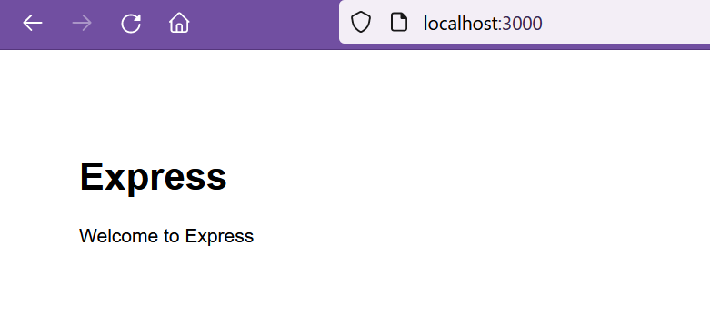
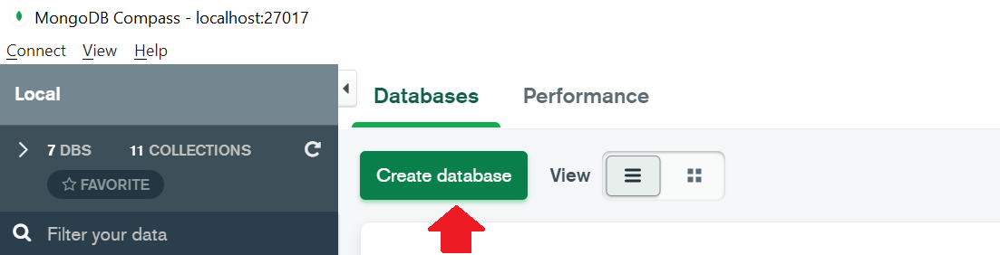
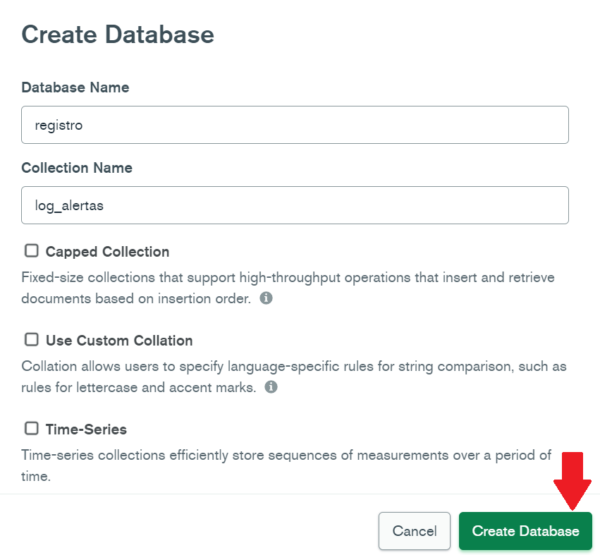
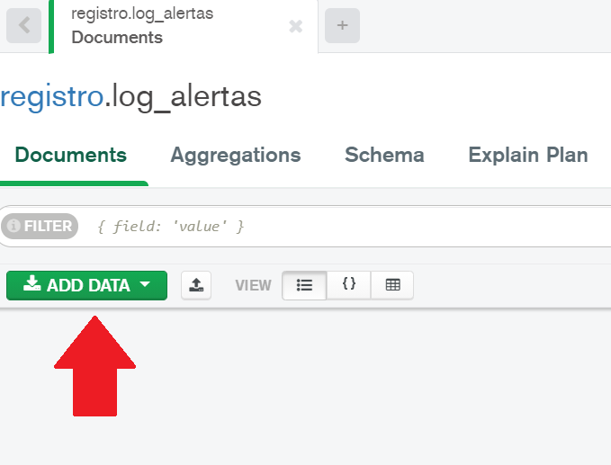
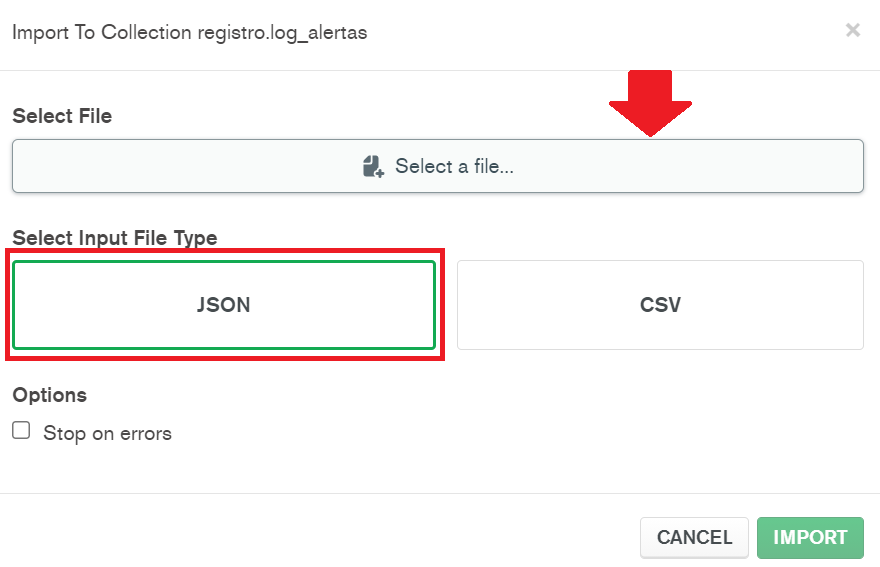
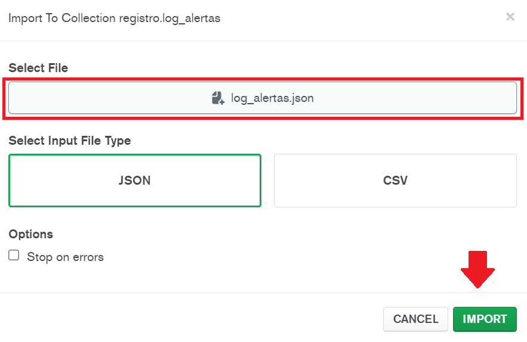

[Regresar](/CodingBootcampsESPOL-FullStackDeveloper/)

# CRUD

* Iniciamos utilizando el  generador de aplicaciones de express, para ello ejecutamos el siguiente comando:

```
npm i -g express-generator
```
* Creamos un sitio de prueba **sitioAlerta** ejecutando el siguiente comando:

```
express --view=ejs sitioAlerta
```
* Cambie de directorio e instale las dependencias. Luego, ejecute la app que ha creado.

```
cd sitioAlerta
npm install
SET DEBUG=sitioalerta:* & npm start
```
* Acceda al URL [http://localhost:3000/](http://localhost:3000/).

<p align="center">

</p>

* Para los datos descargue el archivo [log_alertas.json](./log_alertas.json)

### MongoDB

Para está práctica de ODM se estará utilizando el software de MongoDB así que verifique que tenga instalado los siguientes software:
    Motor de base de datos: [MongoDB Community Server](https://www.mongodb.com/try/download/community).
    Interfaz gráfica: [MongoDB Compass](https://www.mongodb.com/try/download/compass).
* Es momento de crear la base de datos **registro** y la colección **log_alertas**. 

<p align="center">

</p>

<p align="center">

</p>

<p align="center">

</p>

Luego, cargue el archivo [log_alertas.json](./log_alertas.json) en la colección log_alertas.

<p align="center">

</p>

<p align="center">

</p>

### Mongoose

* Se instalará de forma global Mongoosejs CLI ejecutando el siguiente comando:

```
npm i -g mongoosejs-cli
```

* En el proyecto, ejecute el comando:

```
npm install --save mongoose
```

* Ahora genere los archivos de configuración de Sequelize, con:

```
npx mongoosejs-cli init
```
* En el archivo de configuración **config/config.json** con la URL de la base de datos que creamos anteriormente. Utilizaremos, el ambiente de **development**.

```json
"development": {
    "database": {
      "url": "mongodb://localhost:27017/registro",
      "options": {
        "useNewUrlParser": true
      }
    }
  }
```

### Modelo

Es momento de crear el modelo que es la representación abstracta de las entidades de la base de datos no relacional.

* En la línea de comando ubicado en el proyecto actual, ejecuta el siguiente comando para crear el modelo **log_alertas**.

```
npx mongoosejs-cli model:create --name log_alertas --attributes usuario:String,ciudad:String,latitud:Number,area:Number,tipo_alerta:String,fecha_alerta:Date
```
   - En la carpeta **models** se ha añadido el archivo log_alertas.js con los atributos especificados en el comando anterior. 

### Manejador de rutas y controladores

* Se adjuntará un nuevo manejador de rutas `routes/log_visitas.js`. Además, incluya el controlador de la ruta `findAll/json` que responda con un archivo json con todos los documentos de la colección.

```js
var express = require('express');
var router = express.Router();

const models = require('../models').default;

router.get('/findAll/json', async (req, res, next) => {

    try {
        const alertasResultado = await models.log_alertas.find;
        return res.json(alertasResultado)
    } catch (err) {
        res.status(500).json(err);
    }
  });

  
module.exports = router;
```


* En el archivo **apps.js** agregaremos el manejador de rutas `’./routes/log_alertas’` y la ruta `/log_alertas`.

```js
...
var logAlertasRouter = require('./routes/log_alertas');
app.use('/log_alertas', logAlertasRouter);
...
```

* Es momento de verificar el funcionamiento del servidor ejecutando el siguiente comando:

```
npm start
```