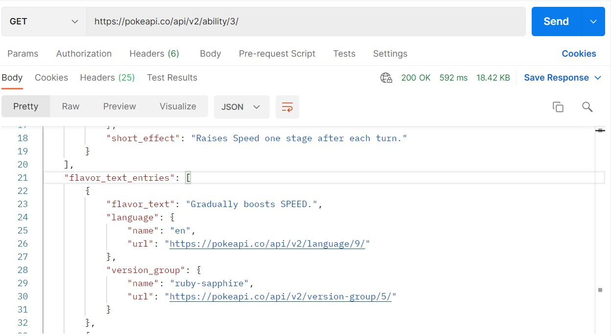

[Regresar](/CodingBootcampsESPOL-FullStackDeveloper/)

# Métodos HTTP

## Contenido

- [Fundamentos teóricos](#fundamentos_teoricos)
  - [Métodos de petición HTTP](#metodos_http)
    - [Get](#get)
    - [Post](#post)
    - [Put](#put)
    - [Delete](#delete)
    - [Options](#options)
    - [Head](#head)
    - [Patch](#patch)
- [Parte práctica](#practica)
- [Referencias](#referencias)

## 📑 Fundamentos teóricos

### 🟠 Métodos de petición HTTP

HTTP define un conjunto de métodos de petición para indicar la acción que se desea realizar para un recurso determinado.  Cada uno de ellos implementan una semántica diferente, pero algunas características similares son compartidas por un grupo de ellos. En resumen, los métodos HTTP, son el formato de comunicación entre el cliente y servidor web. Maneja varios varios formatos: POST, GET, PUT, DELETE, OPTIONS, HEAD, PATCH, etc.

  

#### 🔹 Get

Es uno de los métodos HTTP, este realiza una petición a un recurso específico. No permite el envió de datos a excepción si dichos datos se envían como parámetro en la Url que realiza la petición. Esta petición retorna tanto la cabecera como el contenido. Ahora, este método GET puede retornar una respuesta en formato HTML, JSON, XML, Imágenes o JavaScript. 

#### 🔹 Post

Es otro de los métodos HTTP, este puede enviar datos al servidor por medio del cuerpo (body) y nada por la Url como se emplea en el método GET. El tipo de cuerpo de solicitud se define en la cabecera Content-Type. Semánticamente se utiliza para registrar información, similar al INSERT de datos a nivel de base de datos. 

#### 🔹 Put

Es similar al método de petición POST, solo que el método PUT es idempotente; es decir puede ser ejecutado varias veces y tiene el mismo efecto, caso contrario a un POST que cada vez que se ejecuta realiza la agregación de un nuevo objeto, ya que semánticamente es como una inserción de un nuevo registr

#### 🔹 Delete

Este método de petición permite eliminar un recurso específico.  También es idempotente; es decir puede ser ejecutado varias veces y tiene el mismo efecto similar al PUT y GET. Semánticamente se utiliza para eliminar de información existente, es semejante a un DELETE de datos a nivel de base de datos. 

#### 🔹 Options

Este método se utiliza para comprobar que opciones de comunicación posee el recurso de destino. Es más utilizado con CORS (Cross-Origin Resource Sharing), para revisar si el servidor acepta peticiones de diferentes orígenes. 

#### 🔹 Head

Este método de petición es similar al método HTTP GET, sin embargo no retorna ningún contenido HTTP Response. Cuando se trabaja con este método de petición no se está interesado en el contenido, solo en el código de HTTP de Respuesta y el encabezado (Headers).

#### 🔹 Patch

Este método se emplea para modificaciones parciales de un recurso en particular. Se debe revisar si el servidor es compatible con peticiones PATCH. Para averiguar si el servidor aceptar peticiones PATCH notifica su compatibilidad en el header Allow o Access-Control-Allow-Methods, otra indicación de que estas peticiones están permitidas son el header Accept-Patch.  

## 💻 Parte práctica

Para la parte práctica se utilizara Postman, asegúrese de tener instalado el software en su máquina. 

1️⃣ En tu navegador web busca [pokemon api](https://pokeapi.co/) y dirigite a dicho sitio web.

2️⃣ En la parte superior derecha da clic en la opción [API v2](https://pokeapi.co/docs/v2).

3️⃣ Abre Postman, y en la sección de "Workspace" selecciona la opción de "Create new workspace", y completa los cpos requeridos. 

4️⃣ Ahora en el panel vertical derecho, escoge la opción de "Create collection". Una vez creada, en el panel vertical izquierdo dar clic a “Create request ” . 

5️⃣ Debes copiar el siguiente enlace [https://pokeapi.co/api/v2/ability/{id or name}/] donde dice URL ya que se hara una petición GET. Ten en cuenta que el formato de la url, requiere del id ó name para obtener las habilidades asociadas a dicho pokemon. Luego das clic en el botón "Send" y asi obtendras una petición de tipo GET. Puedes ir probando para diferente id y veras la información asociada al pokemon con dicho id.

## Referencias

* HTTP Request. Retrieved February 10, 2023, from https://www.ionos.es/digitalguide/hosting/cuestiones-tecnicas/http-request/
* Métodos de petición HTTP. Retrieved February 10, 2023, from https://developer.mozilla.org/es/docs/Web/HTTP/Methods
