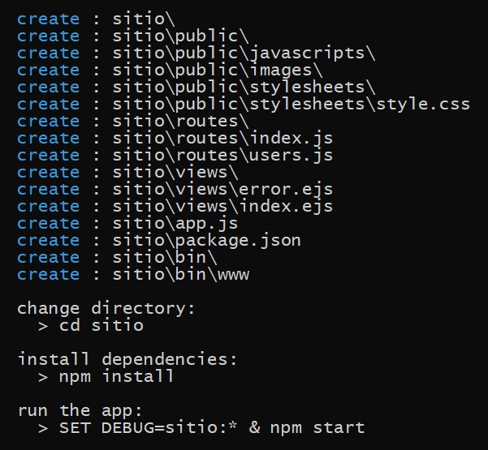
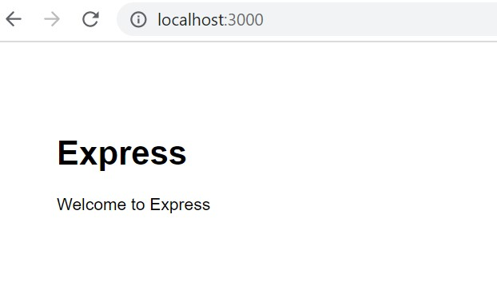

[Regresar](/CodingBootcampsESPOL-FullStackDeveloper/)

Configuración de servidor web con Node.js
=========================================

## Contenido

- [Fundamentos teóricos](#fundamentos_teoricos)
  - [Express](#express)
- [Parte práctica](#practica)
  - [Esqueleto de un proyecto web](#esqueleto)
- [Referencias](#referencias)

📑 Fundamentos teóricos
===========================

* * *

### 🟠 Express

Express es una infraestructura de aplicaciones web Node.js mínima y flexible que proporciona un conjunto sólido de características para las aplicaciones web y móviles.

💻 Parte práctica
=====================

* * *

Esqueleto de un proyecto web en Node
============================

Para la construcción del sitio web se utilizará el [generador de aplicaciones de express](https://expressjs.com/en/starter/generator.html). En la linea de comandos ejecute las siguientes instrucciones:  

* Instale el **express-generator**, con: `npm i -g express-generator`

* Cree un sitio de prueba llamado **sitio**, con: `express --view=ejs sitio`

* La aplicación generada tendrá la siguiente estructura de directorios. 

  <pre><code>
    .
    ├── app.js           <b style="background-color: #00aae4;"># Configuración para la aplicación que se ejecutará en el servidor</b>
    ├── package.json     <b style="background-color: #00aae4;"># Módulos de la aplicación</b>
    ├── package-lock.json
    ├── bin
    │   └── www          <b style="background-color: #00aae4;"># Punto de arranque de la aplicación - Lee el archivo app.js</b>
    ├── public           <b style="background-color: #00aae4;"># Directorio de archivos estáticos</b>
    │   ├── images
    │   ├── javascripts
    │   └── stylesheets
    │       └── style.css
    ├── routes           <b style="background-color: #00aae4;"># Rutas de la aplicación.</b>
    │   ├── index.js
    │   └── users.js
    └── views            <b style="background-color: #00aae4;"># Vistas de la aplicación por renderizar.</b>
        ├── error.ejs
        └── index.ejs
  </code></pre>

* El archivo `app.js` contiene la configuración para la aplicación web que se ejecutará en el servidor, con las siguientes partes
  + Módulos para la aplicación web

  <pre><code>
    var createError = require('http-errors');    <b style="background-color: #00aae4;"># Manejo de errores por defecto</b>
    var express = require('express');            <b style="background-color: #00aae4;"># Arquitectura de la aplicación en backend</b>
    var path = require('path');                  <b style="background-color: #00aae4;"># Manejo de rutas</b>
    var cookieParser = require('cookie-parser'); <b style="background-color: #00aae4;"># Manejo de cookies</b>
    var logger = require('morgan');              <b style="background-color: #00aae4;"># Registro (log) de acciones del servidor</b>
  </code></pre>

  + Referencia a los archivos con las rutas internas 

  <pre><code>
    var indexRouter = require('./routes/index'); <b style="background-color: #00aae4;"># Carga del manejador de subrutas para la ruta index</b>
    var usersRouter = require('./routes/users'); <b style="background-color: #00aae4;"># Carga del manejador de subrutas para la ruta users </b>
  </code></pre> 

  + Instanciación de la aplicación

  <pre><code>
    var app = express();
  </code></pre>

  + Vistas (EJS que serán renderizadas en HTML)

  <pre><code>
    // view engine setup
    app.set('views', path.join(__dirname, 'views')); <b style="background-color: #00aae4;"># Ruta a los archivos físicos que contienen las vistas </b>
    app.set('view engine', 'ejs');                     <b style="background-color: #00aae4;"># Motor de renderización - EJS</b>
  </code></pre>

  + Configuración de la aplicación

  <pre><code>
    app.use(logger('dev'));                             <b style="background-color: #00aae4;"># Instanciación del registrador (logger) de acciones para el MODO DE DESARROLLO</b>
    app.use(express.json());                            <b style="background-color: #00aae4;"># Este método se usa para analizar las solicitudes entrantes con cargas JSON y se basa en el analizador de cuerpo de mensajes HTTP.</b>
    app.use(express.urlencoded({ extended: false }));   <b style="background-color: #00aae4;"># Analiza las requests entrantes con cargas codificadas y se basa en body-parser. </b>
    app.use(cookieParser());                            <b style="background-color: #00aae4;"># Manejo de cookies entre el cliente y el servidor </b>
    app.use(express.static(path.join(__dirname, 'public')));     <b style="background-color: #00aae4;"># Registro de la ruta para archivos estáticos (imágenes, hojas de estilo, etc)</b>
  </code></pre>

  + Relación entre las rutas externas y las rutas internas 

  <pre><code>
    app.use('/', indexRouter);              
    app.use('/users', usersRouter);        
  </code></pre>

  + Middleware para errores

  <pre><code>
    // catch 404 and forward to error handler
    app.use(function(req, res, next) {
      next(createError(404));               <b style="background-color: #00aae4;"># En caso de cualquier error, lanzar un error404 </b>
    });
  
    // error handler
    app.use(function(err, req, res, next) {
      // set locals, only providing error in development
      res.locals.message = err.message;
      res.locals.error = req.app.get('env') === 'development' ? err : {}; <b style="background-color: #00aae4;"># Los errores se mostrarán en el MODO DE DESARROLLO </b>

      // render the error page
      res.status(err.status || 500);
      res.render('error');
    });
  </code></pre>

* Los siguientes comandos nos ayudarán a comprobar el funcionamiento del servidor. Cada comando es ejecutado individualmente. 

    <pre><code>
      cd sitio   
      npm install   
      SET DEBUG=sitio:\* & npm start
    </code></pre>

* Luego, acceda a  `http://localhost:3000/` en su navegador para visualizar su aplicación. 

Referencias
===================

* * *

* Express. Retrieved February 24, 2023, from https://expressjs.com/es/ 
* Introducción a Express/Node - Aprende sobre desarrollo web MDN. Recuperado el 24 de febrero de 2023, de https://developer.mozilla.org/es/docs/Learn/Server-side/Express_Nodejs/Introduction
Tutorial Express Parte 2: Creando un sitio web esqueleto - Aprende desarrollo web MDN. Recuperado el 24 de febrero de 2023, de https://developer.mozilla.org/en-US/docs/Learn/Server-side/Express_Nodejs/skeleton_website 
