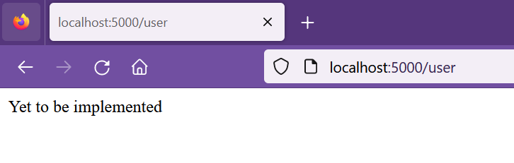
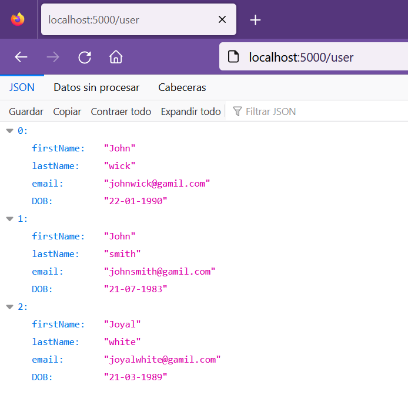
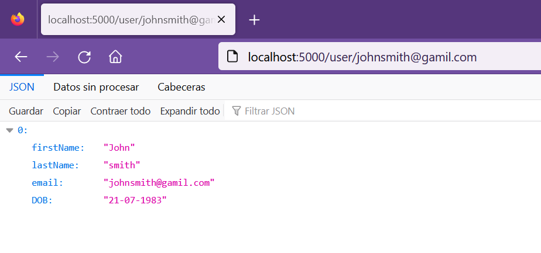
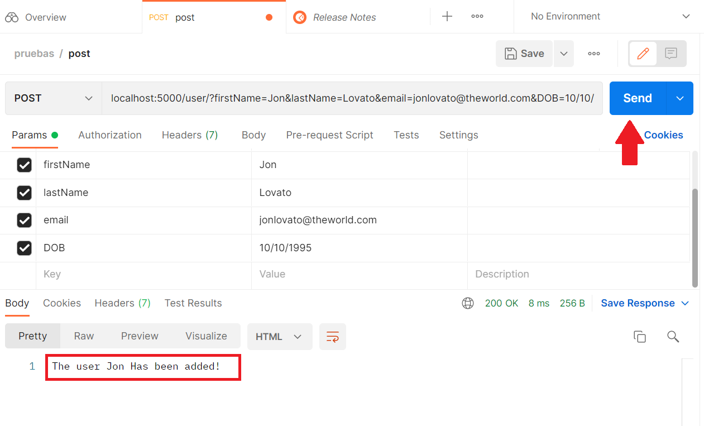
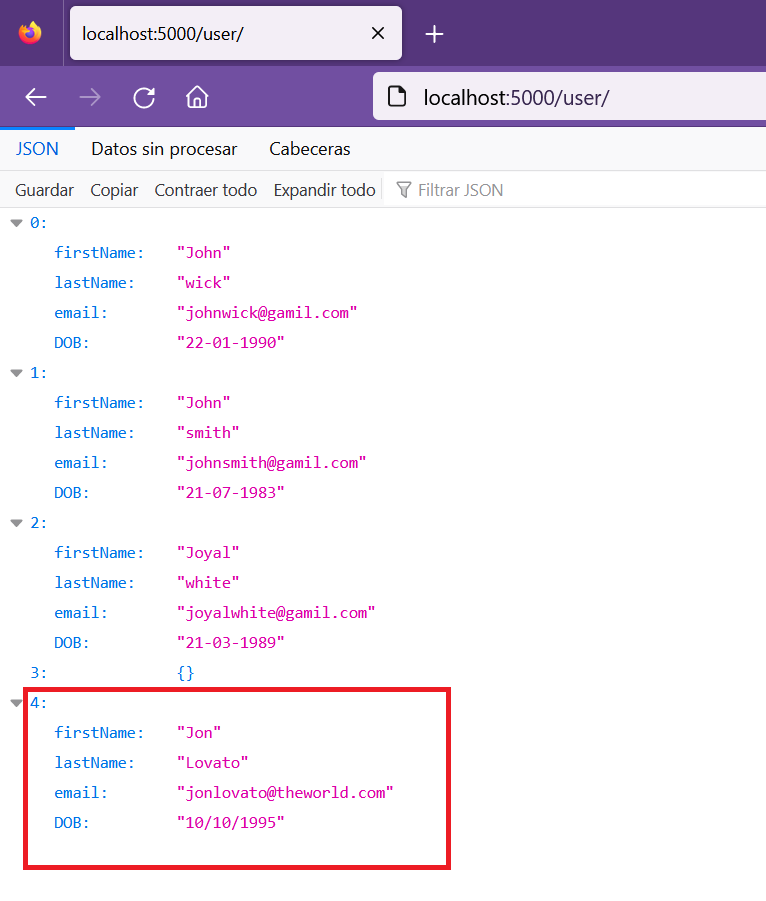
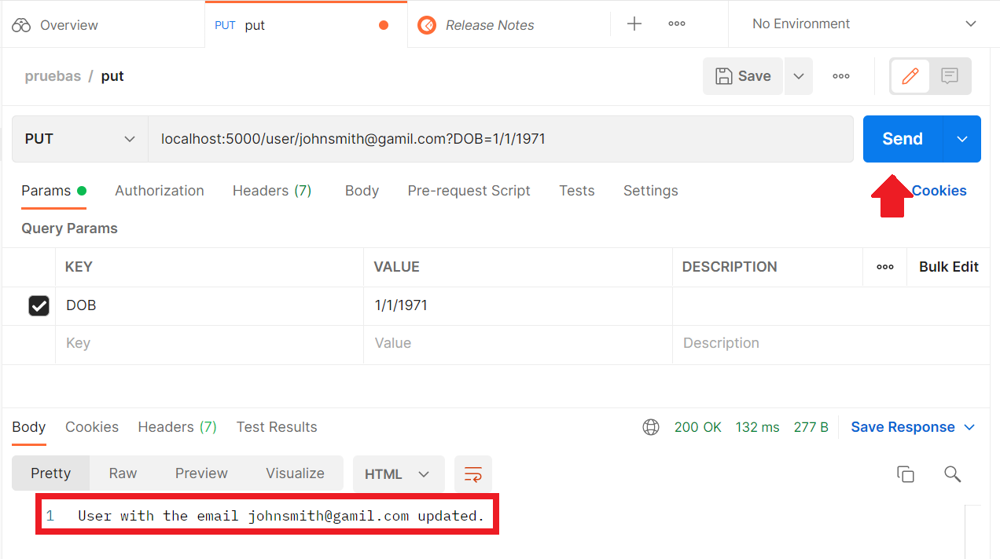
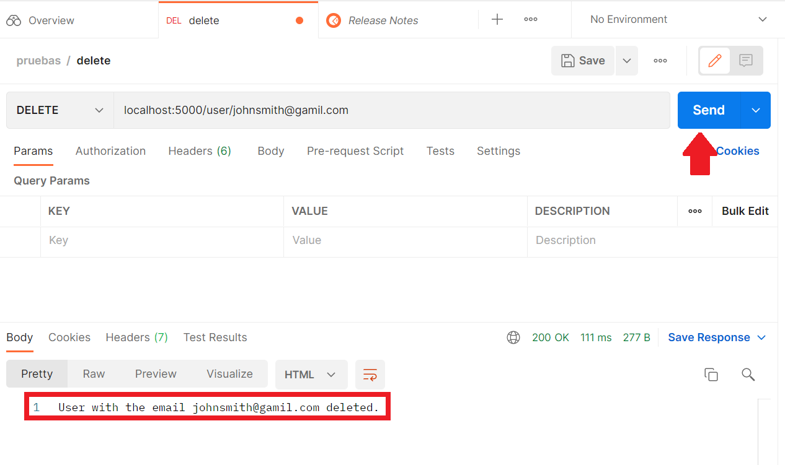

[Regresar](/CodingBootcampsESPOL-FullStackDeveloper/)

CRUD for objects
==========================================

## Contenido

- [Fundamentos teóricos](#fundamentos_teoricos)
  - [¿Qué es CRUD?](#crud)
- [Parte práctica](#practica)

<a name="fundamentos_teoricos"> </a>

## 📑 Fundamentos teóricos

<a name="crud"> </a>

¿Qué es CRUD?
==========================================

CRUD hace referencia a un acrónico, en él que se unen las letras iniciales de las cuatro operaciones principales de aplicaciones en base de datos:

* **C**reate: crea registros
* **R**ead: lee registros
* **U**pdate: actualiza registros
* **D**elete: elimina registros

<p align="center">

</p>

<a name="practica"></a>

Parte práctica
===================

* * *

* Descargue el proyecto base del [sitio CRUD](../recursos/sitio-CRUD.rar) y descomprimalo. 
En el curso se estará trabajando con un proyecto relacionado con la prevención de incendios forestales. Por tal razón, en está práctica de CRUD se basará en los usuarios que accederán a este sistema.

### Comprender la aplicación del servidor

Recuerde que GET, POST, PUT y DELETE son los métodos HTTP comúnmente utilizados para realizar operaciones CRUD. Esas operaciones recuperan y envían datos al servidor.

* GET se utiliza para solicitar datos de un recurso específico.

* POST se utiliza para enviar datos a un servidor para crear un recurso.

* PUT se utiliza para enviar datos a un servidor para actualizar un recurso.

* DELETE se utiliza para eliminar un recurso específico.

* POST AND PUT a veces se usan indistintamente.

Esta práctica de laboratorio requiere la instalación de algunos paquetes. El paquete express y nodemon para iniciar y ejecutar el servidor Express y jsonwebtoken y express-session para la autenticación basada en sesiones.
- **express:** esto es para crear un servidor para atender los puntos finales de la API.
- **nodemon:** esto ayudará a reiniciar el servidor cuando realice cambios en el código.
- **jsonwebtoken:** este paquete ayuda a generar un token web JSON que usaremos para la autenticación. Un token web JSON (JWT) es un objeto JSON que se utiliza para comunicar información de forma segura a través de Internet (entre dos partes). Se puede utilizar para el intercambio de información y normalmente se utiliza para sistemas de autenticación.
- **express-session:**  Este paquete nos ayudará a mantener la autenticación para la sesión.

### Ejecutar el servidor

* Instale todos los paquetes necesarios para ejecutar el servidor. Copie, pegue y ejecute el siguiente comando.

```
npm install
```

* Inicie el servidor express.

```
npm start
```
* En el navegador accede a [http://localhost:5000/user](http://localhost:5000/user)

<p align="center">

</p>

Si ve el resultado como se muestra en la imagen de arriba, significa que el servidor se está ejecutando como se esperaba.

### Implementar los endpoints 

* Navegue hasta el archivo llamado users.js en la carpeta de routes. Los endpoints se han definido y se encuentra el espacio respectivo para su implementación. 

* **R** en CRUD significa recuperar. Primero agregará un endpoint de API, usando el método get para obtener los detalles de todos los usuarios. Se han agregado algunos usuarios en el código de inicio. Copie el código a continuación y péguelo en users.js dentro de los corchetes { } dentro del método router.get(“/“,(req,res)=>{}).

```js
// GET request: Retrieve all users
router.get("/",(req,res)=>{
  // Copy the code here
  res.send(users)//This line is to be replaced with actual return value
});
```

* Verifique que está en ejecución el servidor y acceda a la [url](http://localhost:5000/user) correspondiente. En donde se visualizará los usuarios registrados en la aplicación.

<p align="center">

</p>

### Creación de un GET by de correo electrónico específico

* Implemente un método de obtención para obtener los detalles de un usuario específico en función de su ID de correo electrónico utilizando el método de filter en la colección de usuarios.

```js
// GET by specific ID request: Retrieve a single user with email ID
router.get("/:email",(req,res)=>{
  const email = req.params.email;
    let filtered_users = users.filter((user) => user.email === email);
    res.send(filtered_users);
});
```
* Verifique que el servidor este en ejecución y en el navegador accede a [localhost:5000/user/johnsmith@gamil.com](http://localhost:5000/user/johnsmith@gamil.com) y efectivamente se está obteniendo la información de ese email en específico.

<p align="center">

</p>

### Creación del método POST

* La C en CRUD significa Crear. Implemente el punto final /user con el método POST para crear un usuario y agregarlo a la lista. 
Use push para agregar el diccionario a la lista de usuarios. Los detalles del usuario se pueden pasar como parámetros de consulta denominados firstName, lastName, DOB y email.

```js
// POST request: Create a new user
router.post("/",(req,res)=>{
  users.push({"firstName":req.query.firstName,"lastName":req.query.lastName,"email":req.query.email,"DOB":req.query.DOB});
  res.send("The user" + (' ')+ (req.query.firstName) + " Has been added!")
});
```

* Crearemos un nuevo usuario con la identificación de correo 'jonlovato@theworld.com' en la nueva terminal.
* Usaremos la plataforma Postman para hacer la solicitud POST y así crear un nuevo usuario en la aplicación, considera los siguientes datos para nuestro usuario. 

```json
{
    "firstName":"Jon",
    "lastName":"Lovato",
    "email":"jonlovato@theworld.com",
    "DOB":"10/10/1995"
}
```
<p align="center">

</p>

* En el navegador accede a la [url de usuarios](http://localhost:5000/user) y se encontrará el nuevo usuario. 

<p align="center">

</p>

### Crear el método PUT

La U en CRUD significa actualización que se puede lograr utilizando el método PUT. Para realizar actualizaciones en los datos, utilizará el método PUT.

```js
// PUT request: Update the details of a user by email ID
router.put("/:email", (req, res) => {
  const email = req.params.email;
    let filtered_users = users.filter((user) => user.email === email);
    if (filtered_users.length > 0) {
        let filtered_user = filtered_users[0];
        let DOB = req.query.DOB;
        //if the DOB has changed
        if(DOB) {
            filtered_user.DOB = DOB
        }
        /*
        Include code here similar to the one above for other attibutes
        */
        users = users.filter((user) => user.email != email);
        users.push(filtered_user);
        res.send(`User with the email  ${email} updated.`);
    }
    else{
        res.send("Unable to find user!");
    }
});
```

Usando Postman se actualizará el DOB 1/1/1971 para el usuario con correo 'johnsmith@gamil.com'. 

<p align="center">

</p>

### Crear el método DELETE

La "D" en CRUD significa Eliminar. Implemente el método DELETE para eliminar el correo electrónico de un usuario específico utilizando el siguiente código:

```js
// DELETE request: Delete a user by email ID
router.delete("/:email", (req, res) => {
  const email = req.params.email;
    users = users.filter((user) => user.email != email);
    res.send(`User with the email  ${email} deleted.`);
});
```
Se procede a eliminar el usuario con email johnsmith@gamil.com. 

<p align="center">

</p>