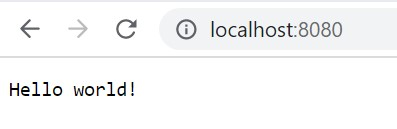

[Regresar](/CodingBootcampsESPOL-FullStackDeveloper/)
# Configuración de servidor web con Node.js

<p align="center">

</p>

## Contenido

- [Fundamentos teóricos](#fundamentos_teoricos)
  - [Node.js](#node)
- [Parte práctica](#practica)
  - [Instalación Node](#instalacion_node)
  - [Configuración de servidor web](confi_web)
- [Referencias](#referencias)

<a name="fundamentos_teoricos"> </a>

## 📑 Fundamentos teóricos

<a name="node"> </a>

### 🟠 Node

Node.js es un marco de programación del lado del servidor que utiliza JavaScript como lenguaje de programación. Node.js es adecuado para los desarrolladores que desean crear aplicaciones de servidor escalables y simultáneas mediante el uso de funciones como funciones de devolución de llamada y el ciclo de eventos de tiempo de ejecución de Node.JS.


<a name="practica"> </a>

## 💻 Parte práctica
<a name="instalacion_node"> </a>

### 🟠 Instalación Node

1️⃣ Visita el sitio oficial de [Node.](https://nodejs.org/)

2️⃣ Para instalar da clic en uno de los botones verdes.

3️⃣ Sigue las instrucciones de instalación. 

<a name="confi_web"> </a>

### 🟠 Configuración de servidor web

Una vez instalado Node.js en su computadora, creamos un programa que muestre "Hello World" en un navegador web.

1️⃣ En el editor de texto de su preferncia, cree un archivo Node.js en este caso le pondremos "miPrimerPrograma.js" y copie el siguiente código.

```js
var http = require('http');

http.createServer(function(req,res){
res.writeHead(200, { 'Content-Type': 'text/plain' });
res.end('Hello world!');
}).listen(8080);
console.log('Server started on localhost:3000; press Ctrl-C to terminate....');
```

2️⃣ Guarde el archivo en su computador. 

3️⃣ Dentro de la línea de comandos en su computadora, diríjase a la carpeta donde se encuentra el archivo "miPrimerPrograma.js". Para abrir la interfaz de línea de comandos en usuarios de Windows, presione el botón de inicio y busque "Símbolo del sistema", o simplemente escriba "cmd" en el campo de búsqueda.

4️⃣ Para iniciar el archivo de Node.js, en el cmd escriba `node "miPrimerPrograma.js"` y presione enter. Ahora, su computadora funciona como un servidor. 

5️⃣ En su navegador de preferencia escriba la siguiente dirección: http://localhost:8080. Se muestre un 'Hello World!' en el navegador. 

<p align="center">

</p>

<a name="referencias"></a>

## Referencias

* Node.js Get Started. Retrieved February 12, 2023, from [https://www.w3schools.com/nodejs/nodejs_get_started.asp](https://www.w3schools.com/nodejs/nodejs_get_started.asp)
