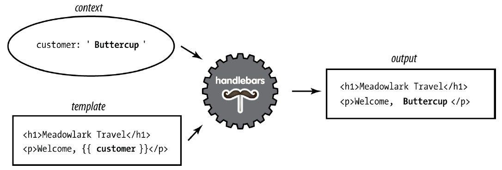

[Regresar](/CodingBootcampsESPOL-FullStackDeveloper/)

# Handlebars

## Contenido

- [Fundamentos teóricos](#fundamentos_teoricos)
  - [Handlebars](#handlebars)
  - [Funcionamiento de Handlebar](#funcionamiento_handlebars)
- [Referencias](#referencias)

## 📑 Fundamentos teóricos

### 🟠 Handlebars

Handlebars es una extensión de Moustache, otro popular motor de plantilla. Se recomienda Handlebars por su fácil. integración de JavaScript (tanto frontend como backend) y su sintaxis familiar. 

### 🟠 Funcionamiento de Handlebar

Para entender el funcionamiento de la plantilla se debe comprender el concepto de contexto. Cuando renderizas una plantilla, pasas al motor de plantillas un objeto llamado objeto de contexto, y esto es lo que permite que los reemplazos funcionen.
Por ejemplo, si mi objeto de contexto es ` { nombre: 'Buttercup' }`, y mi plantilla es `
¡Hola, {{name}}!
`, {{name}} se reemplazará con Buttercup. ¿Qué sucede si desea pasar HTML a la plantilla? Por ejemplo, si nuestro contexto fuera `{ name: '<b>Buttercup</b>' }`, usar la plantilla anterior dará como resultado `
Hola,&lt;b&gt;Buttercup&lt;b&gt;
`, que es probablemente no sea lo que estás buscando. Para resolver este problema, simplemente use tres corchetes en lugar de dos: {{{nombre}}}.

En la imagen anterior vemos cómo el motor Handlebars utiliza el contexto (representado por un óvalo) combinado con la plantilla para renderizar HTML.

## Referencias

* Brown, E. (2014). Web Development with Node and Express. Sebastopol, CA: O'Reilly Media.