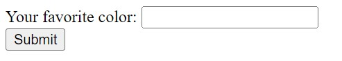

[Regresar](/CodingBootcampsESPOL-FullStackDeveloper/)

# HTML Forms

## Contenido

- [Fundamentos teóricos](#fundamentos_teoricos)
  - [Ejemplo de HTML Forms](#ejemplo)
- [Referencias](#referencias)

<a name="fundamentos_teoricos"> </a>

## 📑 Fundamentos teóricos

<a name="ejemplo"> </a>

### 🟠 Ejemplo de HTML Forms

Se utiliza un formulario HTML para recopilar la entrada del usuario. La entrada del usuario se envía con mayor frecuencia a un servidor para su procesamiento. Es importante comprender algunos conceptos básicos sobre la construcción de formularios HTML. Aquí hay un ejemplo simple:

```html
<form action="/process" method="POST">
    <input type="hidden" name="hush" val="hidden, but not secret!">
    <div>
        <label for="fieldColor">Your favorite color: </label>
        <input type="text" id="fieldColor" name="color">
    </div>
    <div>
        <button type="submit">Submit</button>
    </div>
</form>
```

+ Observe que el método se especifica explícitamente como POST en la etiqueta <form>; si no hace esto, el valor predeterminado es GET.

+ Desde la perspectiva del servidor, el atributo importante en los campos `<input>` son los atributos de nombre: así es como el servidor identifica el campo.

+ Tenga en cuenta el campo oculto: esto no aparecerá en el navegador del usuario. Sin embargo, no debe usarlo para información secreta o confidencial: todo lo que el usuario tiene que hacer es examinar la fuente de la página y el campo oculto quedará expuesto.


<p align="center">

</p>


<a name="referencias"></a>

## Referencias

* HTML Forms. Retrieved February 21, 2023, from https://www.w3schools.com/html/html_forms.asp 
