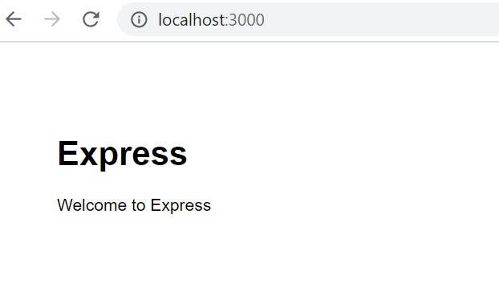

[Regresar](/CodingBootcampsESPOL-FullStackDeveloper/)

# Práctica-U2

## Contenido

- [Parte práctica](#fundamentos_teoricos)
  - [Configuración de proyecto web](#route)
  - [Bootstrap](#bootstrap)
  - [Layout y partials](#layout)
  - [Alertas: layout y partial](#alertas)

<a name="fundamentos_teoricos"> </a>

## 📑 Parte práctica

<a name="route"> </a>

### 🟠 Configuración de proyecto web

En esta sección realizaremos la configuración de un proyecto basado en la prevención de incendios forestales mediante alertas. Por tal razón, se aplicarán temas vistos en la unidad.

* En la línea de comandos, instale el express-generator ejecutando el siguiente comando:

```
npm i -g express-generator
```
* Crearemos un nuevo sitio con el nombre **sitioAdmin**. Notará que se crearon una serie de archivos.

* Cambie de directorio usando el comando:

```
cd sitioAdmin
```

* Instale las dependencias.

```
npm install
```

* Ahora se comprobará el funcionamiento del servidor.

```
SET DEBUG=sitioAdmin:\* & npm start
```
<p align="center">

</p>

* A continuación se agregará el módulo **nodemon** que nos permitirá visualizar los cambios sin la necesidad de reiniciar el servidor. En la línea de comandos, ejecute:

```
npm install --save-dev nodemon
```

* En el archivo **package.json** agregue la clave **devstart** dentro de scripts.

```json
"scripts": {  
    ...
    
    "devstart": "nodemon ./bin/www"
      
      ...
  }  
```

* Para ejecutar el servidor usaremos el comando:

```
npm run devstart
```

<a name="bootstrap"> </a>

### 🟠 Bootstrap

* Accede al sitio de [ejemplos de Bootstrap](https://getbootstrap.com/docs/5.2/examples/) y descargue el zip de ejemplo y descomprima.

* Se utilizará el ejemplo **Dashboard**.

* En nuestro proyecto copiaremos algunos de los archivos de la plantilla **Dashboard**.
    - Copie el archivo **dashboard/dashboard.css** del Ejemplo Dashboard, a la carpeta **public/stylesheets** del Proyecto de Express sitioAdmin.
    - Copie el archivo **dashboard/dashboard.js** del Ejemplo Dashboard, a la carpeta **public/javascripts** del Proyecto de Express sitioAdmin.
    - Del ejemplo de dashboard en el archivo **dashboard/index.html** copia las etiquetas `<header>` y `<div.container-fluid>` y reemplazar todo el contenido copiado en la etiqueta `<body>` del proyecto sitioAdmin en el archivo **views/index.ejs**.
* En el archivo index.ejs de **sitioAdmin** elimine la referencia previa previa a cualquier hoja de estilo o script y agregue la referencia a las hojas de estilo bootstrap y dashboard.css.

```html
  <head>
	...
	<link href="https://cdn.jsdelivr.net/npm/bootstrap@5.2.3/dist/css/bootstrap.min.css" rel="stylesheet" integrity="sha384-rbsA2VBKQhggwzxH7pPCaAqO46MgnOM80zW1RWuH61DGLwZJEdK2Kadq2F9CUG65" crossorigin="anonymous">
    <link rel='stylesheet' href='/stylesheets/dashboard.css' />
  </head>
```

* Agregue la referencia a bootstrap.bundle.min.js, feather.min.js, Chart.min.js y dashboard.js.

```html
<body>
	...
	<script src="https://cdn.jsdelivr.net/npm/bootstrap@5.2.3/dist/js/bootstrap.bundle.min.js" integrity="sha384-kenU1KFdBIe4zVF0s0G1M5b4hcpxyD9F7jL+jjXkk+Q2h455rYXK/7HAuoJl+0I4" crossorigin="anonymous"></script>
    <script src="https://cdn.jsdelivr.net/npm/feather-icons@4.28.0/dist/feather.min.js" integrity="sha384-uO3SXW5IuS1ZpFPKugNNWqTZRRglnUJK6UAZ/gxOX80nxEkN9NcGZTftn6RzhGWE" crossorigin="anonymous"></script>
    <script src="https://cdn.jsdelivr.net/npm/chart.js@2.9.4/dist/Chart.min.js" integrity="sha384-zNy6FEbO50N+Cg5wap8IKA4M/ZnLJgzc6w2NqACZaK0u0FXfOWRRJOnQtpZun8ha" crossorigin="anonymous"></script>
    <script src="/javascripts/dashboard.js"></script>
</body>
```

* Ejecute el servidor y acceda a la URL [http://localhost:3000/](http://localhost:3000/)

```
npm run devstart
```
<p align="center">

</p>

<a name="layout"> </a>

### 🟠 Layout y partials

El uso de partials en Express permite ahorrar líneas de código y reutilizar componentes. 

* Del archivo `views/index.ejs`.
    - Extraiga la etiqueta `<main>` junto con todo su contenido.
* Dentro de la carpeta views
    - Cree la carpeta **partials** .
* Cree el archivo **views/partials/main.ejs**.
    - Pegue las etiquetas copiadas dentro del archivo **views/partials/main.ejs**.
* En el archivo **views/index.ejs**.
    - Coloque `<%- include("partials/main") -%>`, en el lugar donde se encontraba la etiqueta `<main>`.

* Del views/index.ejs, repite el proceso anterior para las etiquetas `<header>` y `<nav>`.

    - Coloque la etiqueta `<header>` en el partial **views/partials/header.ejs**.

<a name="alertas"> </a>

### 🟠 Alertas: layout y partial

Para la creación de nuestra página de alertas utilizaremos el siguiente recurso [alertas.rar](./alertas.rar).

* Copie el archivo `alertas.ejs` dentro de la carpeta **views**.
* Copie el archivo `alertas_tabla.ejs` dentro de la carpeta **views/partials**.
    - Agregue la referencia al partial `alertas_tabla.ejs`.

* Copie el archivo **table.css** dentro de la carpeta public/stylesheets.
* En el **routes/index.js**.
    - Enlaza la ruta **"/alertas"** con la vista alertas.ejs.

```js
router.get('/alertas', function(req, res, next) {
  res.render('alertas', { title: 'Alertas' });
});
```

* Verificar el funcionamiento del servidor, con el comando: `npm run devstart` y acceder a la URL [http://localhost:3000/alertas](http://localhost:3000/alertas).

<p align="center">

</p>

### Rutas

* En el views/partials/header.ejs
    - Modifique el texto y la referencia del texto Products por Alertas y Dashboard por:

```js
<li class="nav-item">
    <a class="nav-link" href="alertas">
        <span data-feather="alert-triangle" class="align-text-bottom"></span>
        Alertas
    </a>
</li>
...
  <a class="nav-link active" aria-current="page" href="/">
    ...
    Dashboard
  </a>
... 
```

* Verifique el funcionamiento del servidor, con: `npm run devstart` y acceda al URL [http://localhost:3000/](http://localhost:3000/).
    - Acceda en la opción Alertas.
    - Acceda en la opción Dashboard.

<p align="center">

</p>