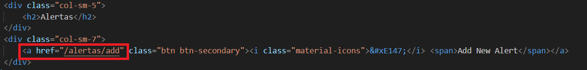
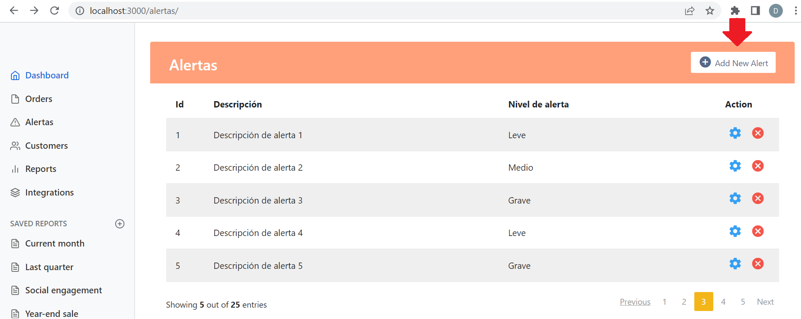
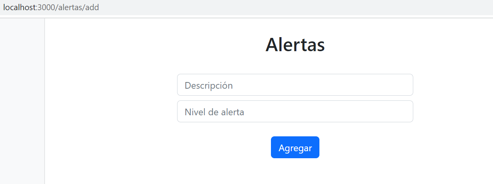
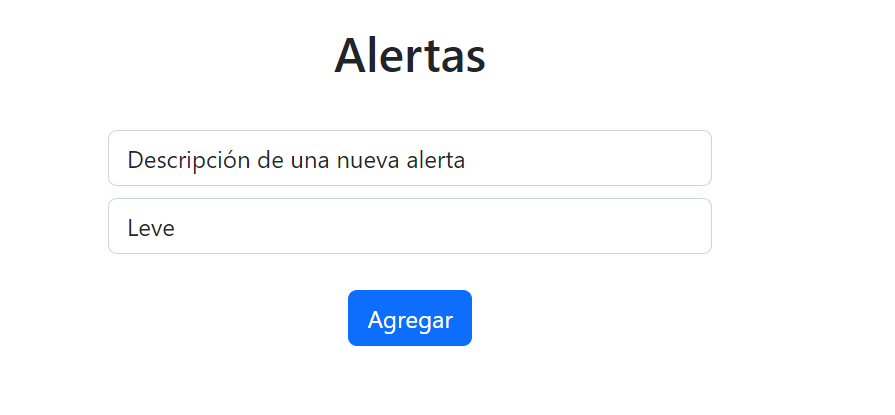

[Regresar](/CodingBootcampsESPOL-FullStackDeveloper/)

# Práctica-U4

## Contenido

- [Parte práctica](#fundamentos_teoricos)
  - [Vista](#vista)
  - [Controlador](#controlador)
  - [Layout y partials](#layout)

<a name="fundamentos_teoricos"> </a>

## 📑 Parte práctica

<a name="vista"> </a>

### 🟠 Vista

Para está práctica seguiremos trabajando con el proyecto [sitioAdmin](./practica_U2.md) realizado en la unidad anterior. 

* Para realizar las vistas del formulario, descargue y descomprima [alertas_formulario](./alertas_formulario.rar).
    - Mueva el archivo `fotos_formulario.ejs` a la carpeta **sitioAdmin/views**.
    - Mueva el archivo `fotos_formulario_add.ejs` a la carpeta **sitioAdmin/views/partials**.
* Modifique vista sitioAdmin/views/partials/alertas_tabla.ejs
    - Cambie `'#'` por la referencia a la ruta '/alertas/add'.
<p align="center">

</p>

<a name="controlador"> </a>

### 🟠 Controlador

* Agregaremos una nueva ruta para el verbo **GET** `"/alertas/add"` en el archivo index.js (sitioAdmin/routes/index.js).

```js
router.get('/alertas/add', function(req, res, next) {
  res.render('alertas_formulario', { title: 'Express' });
});
```

* Agregaremos una nueva ruta para el verbo **POST** `"/alertas/save"` en el archivo index.js (sitioAdmin/routes/index.js).

```js
router.post('/alertas/save', function(req,res, next){
  alertas.push({'Descripción':req.body.description,'Nivel de alerta':req.body.nivel});
  res.send(" Una nueva alerta ha sido añadida!")
});
```
* Ejecute el servidor con `npm run devstart` y acceda a la sección de **Alertas** y de clic en "Add new Alert".

<p align="center">

</p>

* Luego de dar clic será redirigido a la ruta "/alertas/add"

<p align="center">

</p>

* Complete el formulario con los datos solicitados y de clic en el botón Add.

<p align="center">

</p>