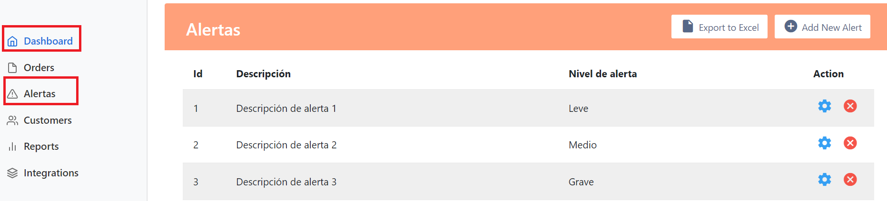
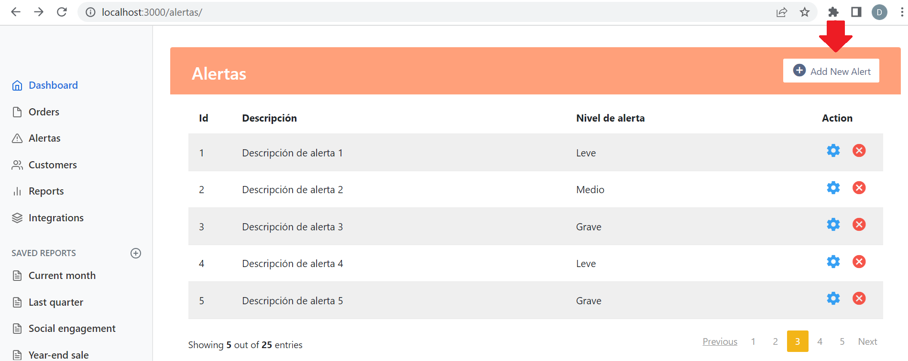
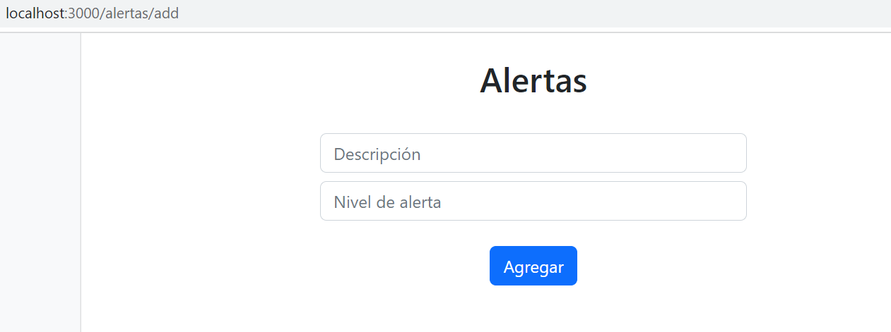

* En el routes/index.js
    - Enlaza la ruta ` "/photos" ` con la vista alertas.ejs.

```js
router.get('/alertas', function(req, res, next) {
  res.render('alertas', { title: 'Alertas' });
});
```

* Verificar el funcionamiento del servidor, con el comando: `npm run devstart` y acceder a la URL [http://localhost:3000/alertas](http://localhost:3000/alertas).

<p align="center">

</p>

## Rutas

* En el views/partials/header.ejs
    - Modifique el texto y la referencia del texto Products por Alertas y Dashboard por:

```js
<li class="nav-item">
    <a class="nav-link" href="alertas">
        <span data-feather="alert-triangle" class="align-text-bottom"></span>
        Alertas
    </a>
</li>
...
  <a class="nav-link active" aria-current="page" href="/">
    ...
    Dashboard
  </a>
... 
```

* Verifique el funcionamiento del servidor, con: `npm run devstart` y acceda al URL [http://localhost:3000/](http://localhost:3000/).
    - Acceda en la opción Alertas.
    - Acceda en la opción Dashboard.

<p align="center">

</p>

##  FORMULARIOS

* Descargue y descomprima alertas_formulario.
    - Mueva el archivo alertas_formulario.ejs a la carpeta admin/views
    - Mueva el archivo alertas_formulario_add.ejs a la carpeta admin/views/partials.

* Modifique vista admin/views/partials/alertas_tabla.ejs
    - Cambie '#' por la referencia a la ruta '/alertas/add'.

<p align="center">

</p>

### Controlador

* Modifique el manejador de rutas admin/routes/index.js
    - Agregue el controlador de la ruta "/alertas/add" para el verbo GET.

```js
router.get('/alertas/add', function(req, res, next) {
  res.render('alertas_formulario', { title: 'Express' });
});
```
* Modifique el manejador de rutas admin/routes/index.js
    - Agregue el controlador de la ruta "/alertas/save" para el verbo POST.    

```js
let alertas = [
];
router.post("/alertas/add",(req,res)=>{
  alertas.push({"description":req.query.description,"nivel":req.query.nivel,"email":req.query.email,"DOB":req.query.DOB});
  res.send(" Has been added!")
});
```

* Ejecute el servidor con `npm run devstart` y acceda a la sección de **Alertas** y de clic en "Add new Alert".

<p align="center">

</p>

* Luego de dar clic será redirigido a la ruta "/alertas/add"

<p align="center">

</p>

* Complete el formulario con los datos solicitados y de clic en el botón Add.

<p align="center">

</p>

// GET request: Retrieve all users
router.get("/",(req,res)=>{
  // Copy the code here
  res.send(users)//This line is to be replaced with actual return value
});